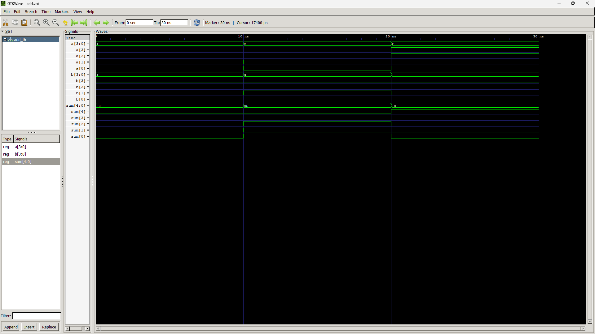

## Simulation and Verification

The `add` module was verified using the provided testbench (`add_tb.vhdl`) and simulated with GHDL. The testbench covers several cases, including a critical test for carry-out functionality.

### Test Case: Carry-Out (15 + 1 = 16)

The waveform below shows the final and most important test case. The inputs are set to `a = "1111"` (15) and `b = "0001"` (1). The 5-bit `sum` output correctly becomes `"10000"` (16), confirming that the adder handles the carry-out bit as expected.



The testbench completed its sequence successfully, which is confirmed by the final message printed during the GHDL simulation:
```
ghdl:info: simulation finished with status note
../add_tb.vhdl:48:9:@30ns:(assertion note): Executed Test Bench
```
